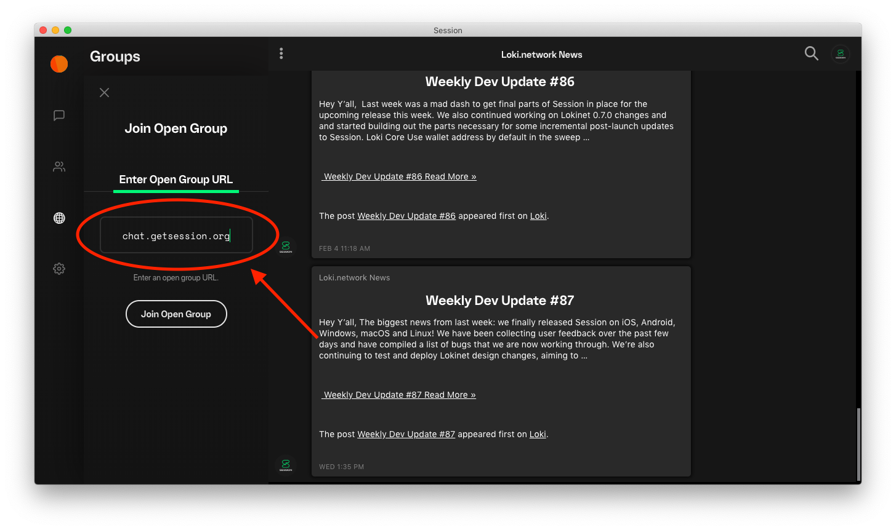
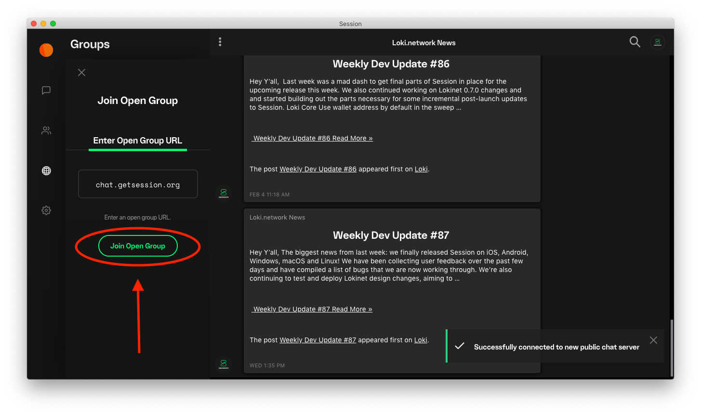

title: Session Docs | How to join a Session open group: Desktop | Decentralised Messenger
description: Session open groups are a great way to host communities on Session. Learn how to join an open group on desktop.

# How to join a Session open group (on desktop)

* Click the ‘globe’ icon in the sidebar:

  

* Click ‘Join Open Group’:

  

* Enter the URL of the open group you’d like to join:

  

* Click ‘Join Open Group’:

  

* Enjoy being part of a new community on Session!

  
