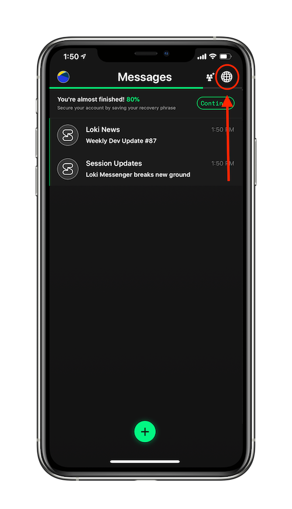
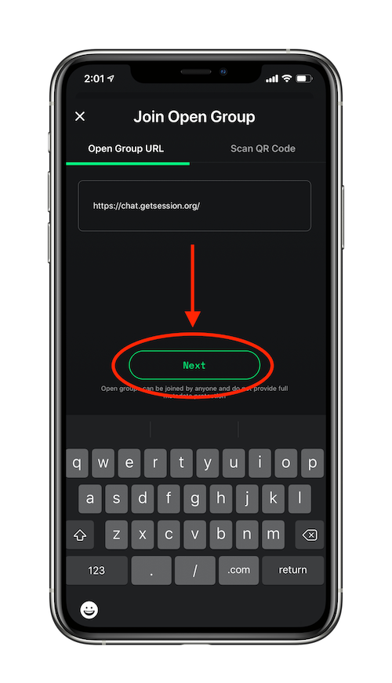
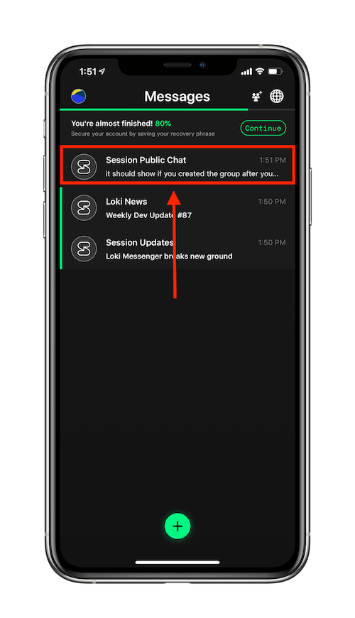

title: Session Docs | How to join a Session open group: Mobile | Decentralised Messenger
description: Session open groups are a great way to host communities on Session. Learn how to join an open group.

# How to join a Session open group (on mobile)

* Tap the ‘globe’ icon.

* Enter the URL of the open group you’d like to join _(be sure to include https:// at the start of the URL!)_

* Tap ‘next’.

* Enjoy being part of a new community on Session!

