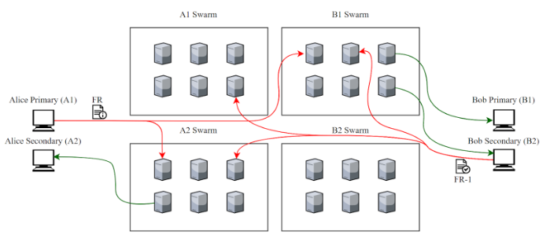

# Multi-Device

Modern messaging applications are expected to sync data (message histories, contact lists, etc.) across multiple devices, ensuring that users are able to move between a laptop and a phone (for example) and continue their conversations where they left off. Such multi-device syncing of messages is more difficult in the context of the Signal protocol since key materials are constantly rotated and deleted after a period of time. This means when messaging other users, an out-of-sync device in a multi-device configuration will encrypt using the wrong keypairs. Sesame, Signal’s session management algorithm, attempts to resolve this, but must rely on a central server to provide a consistent transcript of messages to multiple user devices. Since Session does not rely upon central servers, Session requires a different solution, which we broadly refer to as ‘Multi-Device.’

## Device Linking 

Once an account has been created on one device (referred to as the primary device), the other device (the secondary device) initiates the linking process, which creates a new public/private key pair. A pairwise channel is established between primary and secondary devices, and the primary device's private keys are shared from the primary device to the secondary device. To the user, it now appears that both primary and secondary devices are using the same public/private key pair.

## Friend Requests

Consider user A with two devices (A1, A2) who wants to start communicating with user B, who also has two devices (B1,B2). User A obtains B’s primary public key, i.e., the pubkey of its primary device (B1), out of band. Using this public key, one of A’s devices (A1) sends a friend request to B’s primary device's swarm containing its prekey bundle and the list of its linked devices (A2). Both primary and secondary devices (B1,B2) scan the primary device's swarm periodically, looking for new friend requests. When A’s friend request is found, either one of the devices is able to accept the friend request and initiate a session with A1. The device that accepts the friend request, say B2, then uses the pre-established pairwise channel to notify the other device (B1) of actions it has taken, and instructs B1 to request a session with all of A’s devices. B2 also establishes any outstanding sessions with A’s devices. Finally, B2 provides A with the public key of all of its own linked devices (B1), so A knows to link them. A and B can now begin communicating in a multi-device setting.

*Alice sends Bob a friend request with multi-device enabled*

## Sending and Receiving Messages 

After the initial friend request process, the clients can start communicating. When client A needs to send a message to a multi-device-enabled user B, they deliver the message to all of B's linked devices  using the established pairwise sessions. Note that secondary devices only poll the primary’s device [swarm](../../../Advanced/SwarmFlagging/) for establishing new sessions; regular data messages are associated with the device’s own keys, and thus arrive at the device’s own swarm. If user A also has multiple devices, they additionally send a copy of the message to all of their other devices, which appear in those device's message history as having been sent by them, ensuring that their message history is synced across devices.

*Multi-device sending: Here, Alice sends a message from her primary device to Bob, who has multi-device enabled. Alice sends a message to Bob’s primary and secondary device swarms. She also sends a message to her own secondary device’s swarm, for later retrieval.*

* Not shown here: Onion requests, swarm message replication

## Open Groups

All open group messages are signed by a user's long-term identity key. Recall that secondary devices have access to the primary device’s long-term identity private key as a result of the linking procedure. The secondary devices thus can sign all open group messages using that key. This ensures that other users in the open group see messages from both the primary and secondary device as coming from the same user (having been signed by the same key).
